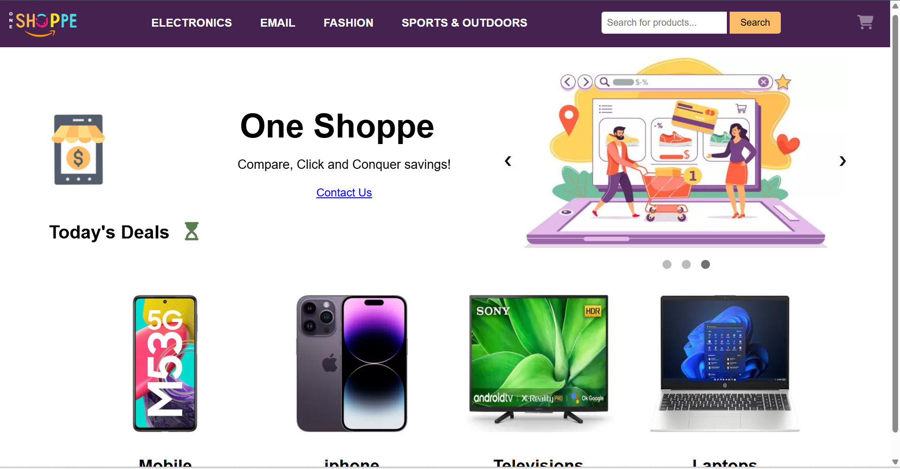
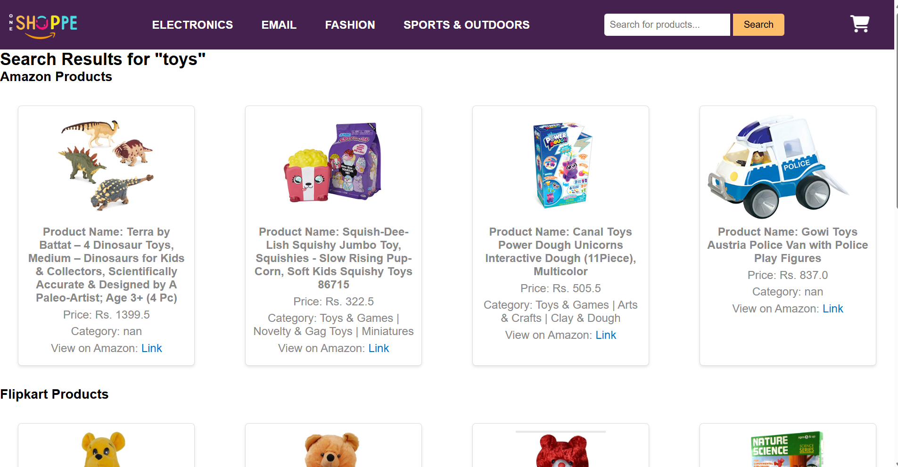
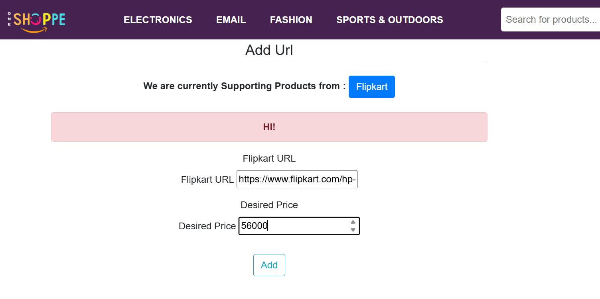

# Price Comparison System


A Django-based web application that compares product prices across multiple e-commerce platforms (Amazon and Flipkart), enabling users to find the best deals and set price alerts for desired products.

## 🚀 Features

- **Multi-platform Price Comparison**: Compare prices between Amazon and Flipkart
- **Advanced Search**: Find products across multiple e-commerce platforms
- **Price Alerts**: Set up notifications when prices drop below a threshold
- **User Authentication**: Register, login, and manage profile
- **Product Categories**: Browse products by categories
- **Responsive Design**: Works seamlessly on desktop and mobile devices
- **Currency Conversion**: Automatic conversion between USD and INR

## 📷 Screenshots


*Main page showing search functionality and featured products*


*Price comparison results from multiple platforms*


*Setting up price drop notifications*

## 🛠️ Technologies Used

- **Backend**: Django, Python
- **Frontend**: HTML, CSS, Bootstrap, JavaScript
- **Data Processing**: Pandas, FuzzyWuzzy
- **Web Scraping**: Selenium, BeautifulSoup, Requests
- **Database**: SQLite (development)
- **Task Scheduling**: Celery

## 📋 Prerequisites

- Python 3.8+
- pip
- Virtual environment (recommended)

## ⚙️ Installation & Setup

1. Clone the repository
```bash
git clone https://github.com/Stv21/pricecomparision-django.git
cd pricecomparision-django
```

2. Create and activate a virtual environment
```bash
python -m venv venv
# On Windows
venv\Scripts\activate
# On macOS/Linux
source venv/bin/activate
```

3. Install dependencies
```bash
pip install -r requirements.txt
```

4. Run migrations
```bash
python manage.py migrate
```

5. Start the development server
```bash
python manage.py runserver
```

6. Visit `http://127.0.0.1:8000/` in your browser

## 🗂️ Project Structure

```
pricecomparision-django/
│
├── home/                  # Main application
│   ├── models.py          # Database models
│   ├── views.py           # View functions
│   └── templates/         # HTML templates
│
├── userproject/           # Project settings
│   ├── settings.py
│   └── urls.py
│
├── static/                # Static assets
│   ├── css/
│   ├── js/
│   └── images/
│
├── screenshots/           # Project screenshots
│
├── manage.py              # Django management script
└── README.md              # Project documentation
```

## 🔍 Usage

1. **Search for Products**: Enter keywords in the search bar
2. **Compare Prices**: View side-by-side price comparisons
3. **Set Price Alerts**: Create an account and set your desired price
4. **Browse Categories**: Explore products by category

## 🔮 Future Enhancements

- Add more e-commerce platforms
- Implement price history graphs
- Add product recommendations
- Develop browser extension
- Create mobile application

## 📝 License

This project is licensed under the MIT License - see the LICENSE file for details.

## 👨‍💻 Author

Your Name - [Your GitHub Profile](https://github.com/Stv21/)

---

*Made with ❤️ and Django*